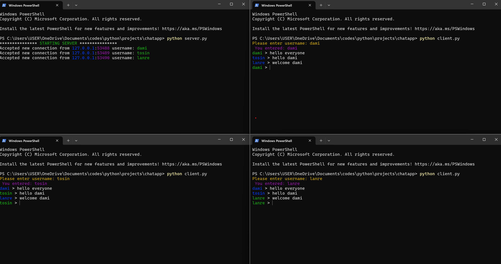

# CLI Chat Application

## Description

This is a simple Command-Line Interface (CLI) chat application built using Python. It allows multiple users to connect to a server and communicate with each other in real-time. The application also includes notification sounds for messages.

## Features

- Real-time messaging between multiple clients.
- Notifications for users joining and leaving the chat.
- Optional sound notifications for incoming messages.
- Graceful shutdown of the server with a broadcast message to all clients.

## Requirements

- Python 3.x
- `colorama` library for colored terminal output
- `simpleaudio` library for playing sound notifications (client-side)

## Installation

1. **Clone the repository:**
   ```bash
   git clone https://github.com/afodamz/python-wifi-connection-chat.git
   cd python-wifi-connection-chat
   ```

2. **Install dependencies:**
   ```bash
   pip install -r requirements.txt
   ```

3. **Ensure `simpleaudio` is installed:**
   ```bash
   pip install simpleaudio
   ```

## Usage

### Running the Server on Same System

1. **Start the server:**
   ```bash
   python server.py --ip <IP_ADDRESS> --port <PORT>
   ```

   - `--ip`: The IP address to bind the server to (default: `127.0.0.1`).
   - `--port`: The port to bind the server to (default: `4040`).

2. **Example:**
   ```bash
   python server.py --ip 127.0.0.1 --port 4040
   ```

### Running the Client

1. **Start the client:**
   ```bash
   python client.py --ip <SERVER_IP_ADDRESS> --port <SERVER_PORT>
   ```

   - `--ip`: The IP address of the server to connect to (default: `127.0.0.1`).
   - `--port`: The port of the server to connect to (default: `4040`).

2. **Example:**
   ```bash
   python client.py --ip 127.0.0.1 --port 4040
   ```
## Running the server with different systems


1. **Identify the Server System's Local IP Address:**
   - On Windows:
     ```cmd
     ipconfig
     ```
   - On macOS/Linux:
     ```bash
     ifconfig
     ```
   Look for the IP address under the Wi-Fi adapter section. It usually starts with something like `192.168.x.x` or `10.x.x.x`.

2. **Start the server:**
   ```bash
   python server.py --ip <SERVER_LOCAL_IP> --port <PORT>
   ```
   - `--ip`: The IP address to bind the server to (default: `127.0.0.1`).
   - `--port`: The port to bind the server to (default: `4040`).

   Example:
   ```bash
   python server.py --ip 192.168.1.5 --port 4040
   ```

### Running the Client

1. **Ensure the Client System is Connected to the Same Wi-Fi Network as the Server:**
   - Ensure all client systems are connected to the same Wi-Fi network as the server system.

2. **Start the client:**
   ```bash
   python client.py --ip <SERVER_LOCAL_IP> --port <PORT>
   ```
   - `--ip`: The IP address of the server to connect to (default: `127.0.0.1`).
   - `--port`: The port of the server to connect to (default: `4040`).

   Example:
   ```bash
   python client.py --ip 192.168.1.5 --port 4040
   ```
   
3. **Enter your username when prompted:**

4. **Send messages:**
   - Type your message and press `Enter` to send it.
   - Type `exit` to close the client.
   - Type `notification off` to turn off notifications.
   - Type `notification on` to turn notifications back on.


### Example Commands

#### On Server System:
```bash
python server.py --ip 192.168.1.5 --port 4040
```

#### On Client System 1:
```bash
python client.py --ip 192.168.1.5 --port 4040
```

#### On Client System 2:
```bash
python client.py --ip 192.168.1.5 --port 4040
```

## Server Code

The server code handles incoming client connections, broadcasting messages, and notifying clients when users join or leave the chat.

## Client Code

The client code connects to the server, sends messages, and receives and displays messages from other users.

## Troubleshooting

- **Connection Refused Error:**
  - Ensure the server is running and the IP address and port are correct.
- **Socket Error:**
  - Ensure no other application is using the same port.
- **Sound Notifications Not Working:**
  - Ensure `simpleaudio` is correctly installed and the sound file exists in the specified directory.


## Firewall and Network Settings

- **Firewall Settings:**
  - Ensure that the firewall on the server system allows incoming connections on the specified port.
  - On Windows, you can add an inbound rule to allow the port through the firewall.
  - On macOS/Linux, ensure the firewall is configured to allow the port.

- **Router Settings:**
  - Typically, for connections within the same local network (LAN), you shouldn't need to change router settings.
  - If you encounter issues, ensure that the router is not blocking local traffic between devices.

---
### Additional Notes

- Ensure your firewall settings allow the specified port.
- The server must be started before any clients can connect.
- To gracefully shut down the server, press `Ctrl+C` in the terminal where the server is running.


